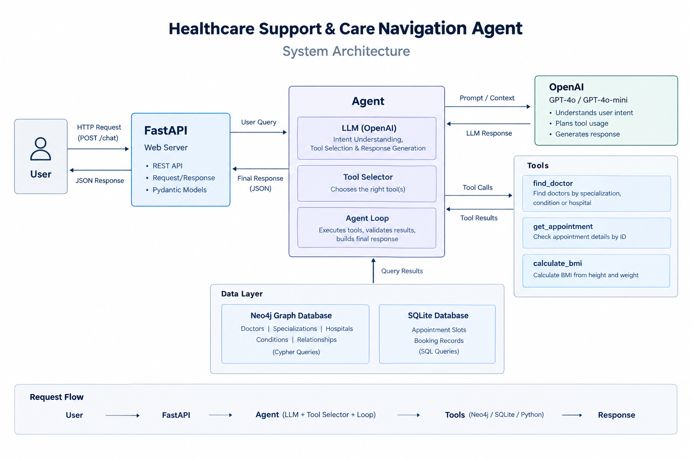

# Healthcare Support & Care Navigation Agent

An agentic AI system demonstrating:
- Native LLM tool calling (OpenAI function calling)
- Agent loop with multi-step reasoning
- Neo4j Knowledge Graph with Cypher queries
- FastAPI REST endpoint

## Architecture

## Quick Start

### 1. Clone and install
pip install -r requirements.txt

### 2. Configure environment
Copy .env and fill in your keys.

### 3. Start Neo4j via Docker
docker run -p 7474:7474 -p 7687:7687 \
-e NEO4J_AUTH=neo4j/your-password \
neo4j:latest

### 4. Seed the Knowledge Graph
python data/seed_graph.py

### 5. Start the API
uvicorn app.main:app --reload

### 6. Open docs
http://localhost:8000/docs

## Test Queries

| Query | Tools Called |
|-------|-------------|
| My weight is 72kg and height is 175cm. What is my BMI? | calculate_bmi |
| What is the status of appointment AP101? | get_appointment |
| I need a cardiologist. | find_doctor(specialization) |
| Which doctors treat hypertension? | find_doctor(condition) — multi-hop |
| Find a cardiologist and also calculate BMI for 80kg 170cm. | find_doctor + calculate_bmi |
| What is the difference between a cardiologist and a neurologist? | None (direct answer) |